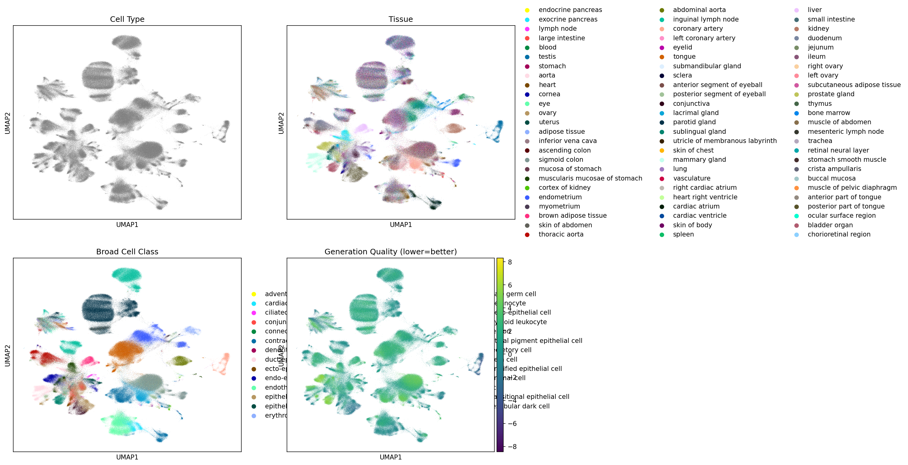
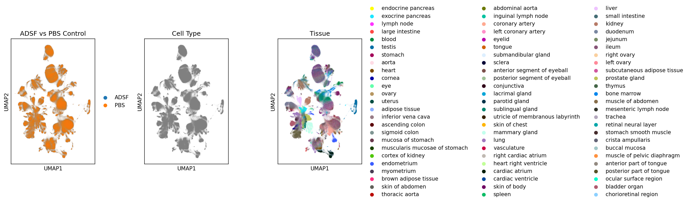

# Stack Model Exploration on Perturb-Sapiens

Exploratory analysis using Arc Institute's **Stack** foundation model on the **Perturb-Sapiens** single-cell perturbation dataset.

## Overview

This notebook demonstrates:
- Loading the Stack-Large model (~2.6GB) from HuggingFace
- Generating cell embeddings for 500K+ cells from Perturb-Sapiens
- UMAP visualization of embeddings colored by cell type and tissue
- Comparing ADSF (cytokine) vs PBS (control) perturbation conditions

## Requirements

- **GPU**: A100 80GB recommended (tested on HPC)
- **Storage**: ~10GB temp space for model + data downloads
- **Python**: 3.10+

```bash
pip install arc-stack scanpy huggingface_hub umap-learn matplotlib
```

## Quick Start

```python
from huggingface_hub import hf_hub_download
from stack.model import load_model_from_checkpoint

# Download model
checkpoint = hf_hub_download("arcinstitute/Stack-Large", "bc_large.ckpt")
genelist = hf_hub_download("arcinstitute/Stack-Large", "basecount_1000per_15000max.pkl")

# Load model
model = load_model_from_checkpoint(checkpoint, device="cuda")

# Generate embeddings
embeddings, indices = model.get_latent_representation(
    adata_path="path/to/data.h5ad",
    genelist_path=genelist,
    batch_size=32
)
```

## Results

| Dataset | Cells | Genes | Embedding Dim |
|---------|-------|-------|---------------|
| ADSF (cytokine) | 513,870 | 15,012 | 1,600 |
| PBS (control) | 460,848 | 15,012 | 1,600 |

### UMAP Visualizations

**Stack embeddings by cell type and tissue:**



**ADSF vs PBS comparison:**



## Acknowledgements

This work uses the **Stack** foundation model and **Perturb-Sapiens** dataset developed by [Arc Institute](https://arcinstitute.org/). We thank the Arc Institute team for making these resources publicly available for research.

## References

- [Stack Model](https://huggingface.co/arcinstitute/Stack-Large) - Arc Institute foundation model trained on 150M single-cell samples
- [Perturb-Sapiens](https://huggingface.co/datasets/arcinstitute/Perturb-Sapiens) - Large-scale human perturbation atlas

## License

Analysis code: MIT  
Stack model weights: [Arc Research Institute Non-Commercial License](https://huggingface.co/arcinstitute/Stack-Large)  
Perturb-Sapiens data: [CC BY-NC-SA 4.0](https://huggingface.co/datasets/arcinstitute/Perturb-Sapiens)
